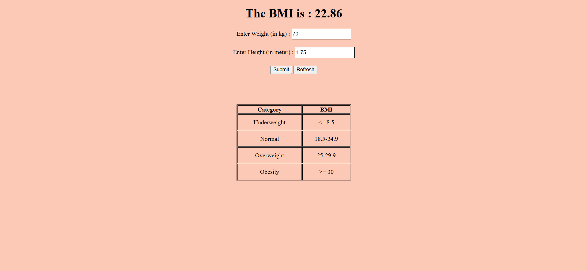

# BMI Calculator Web App
A simple and user-friendly web app that calculates your Body Mass Index (BMI) based on user input for height and weight. This app provides instant feedback on whether the BMI falls within the underweight, normal weight, overweight, or obese range according to standard BMI categories. It is built with HTML, CSS, and JavaScript, making it easy to use and accessible on any device.

# Features:

Input for height (in cm) and weight (in kg).
Instant BMI calculation and category display.
Simple, clean interface.
Perfect for those interested in tracking their health and fitness progress!

